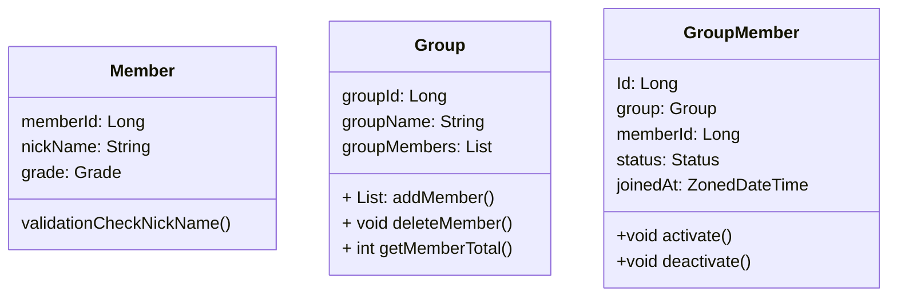

# CLASS DIAGRAM

## Object Map


## Relation 

- `Member`는 N개 이상의 `Group`에 참여할 수 있다.
    ```mermaid
    classDiagram
        Member "1" --* "N" Group: participates
    
        class Member{ }
    
        class Group{ }
    ```

- `Group`은 N개 이상의 `GroupMember`를 가진다.
    ```mermaid
    classDiagram
        Group "1" <.. "N" GroupMember: contains
    
        class Group { }
        class GroupMember { }
    ```
    
    
